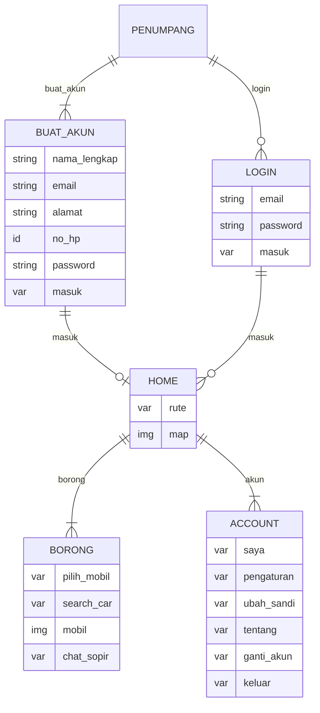
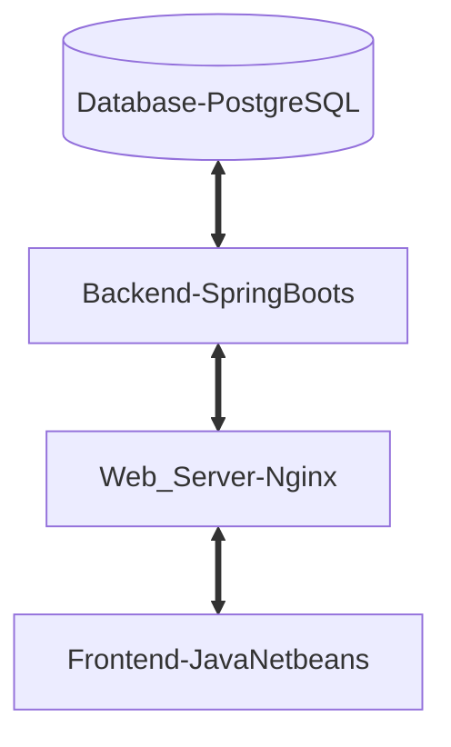

## 1.1 Latar Belakang

   Adanya aplikasi ini karena permasalahan penumpang yang harus menunggu angkot cukup lama dikarenakan pengeteman dan permasalahan sopir yang tertembak 
  karena jarak yang terlalu dekat dengan sopir lain.

## 1.2. Deksripsi Teknologi Informasi
Aplikasi ini berupaya memepermudah penarikan angkot bagi penumapang dan suprinya itu sendiri dan memajukan teknologi informasi di daerah Cikajang terkhusus di bidang transportasi umum yang paling sering di pakai yaitu angkot.
- Bahasa pemograman yang saya gunakan adalah Java
- Code editor yang saya gunakan adalah visual Studio code
- Untuk Desain awal saya gunakan Figma
- Untuk IDE saya gunakan Java NetBeans
- Untuk framework dan beckend saya gunakan Spring Boot
- Untuk database saya gunakan PostgreSQL
  

## 1.3. Branding
- Merk : Eliction
- Tagline : Angkot Online pertama diIndonesia 
- Campaign : Bagaimana membuat aplikasi yang membuat orang merasakan kemudahan dan tidak ribet saat mau naik angkot
- Target User : Semua orang 8 tahun keatas yang sedang berada di Cikajang
- User Experience Theme :
   1.  Mudah
   2.  Sederhana
   3.  Ala ala langit cerah
   4.  Design Inspiration : 

## 2. User Story

Sebagai | Saya ingin bisa  | Sehingga | Prioritas
---|---|---|---
Penumpang |  Memilih rute | Saya bisa mendapatkan tujuan sesuai dengan rute | ⭐⭐⭐⭐⭐
Penumpang |  Melihat angkot di peta | Saya bisa mnegetahui angkot yang terdekat sesuai jalur yang saya pilih | ⭐⭐⭐⭐⭐
Penumpang | Menekan ikon account | Saya bisa kehalaman akun | ⭐⭐⭐⭐⭐
Penumpang | Menekan ikon Borong | Saya bisa kehalaman borong | ⭐⭐⭐⭐⭐
Penumpang | Menekan ikon home  | Saya bisa kembali ke halaman  awal | ⭐⭐⭐⭐⭐
Penumpang | Memilih mobil yang mau saya borong | Saya bisa mengetahui jenis mobil dan supirnya | ⭐⭐⭐⭐⭐
Penumpang | Melihat detail mobil yang mau saya borong | Saya lebih tau detail dari mobil yang saya pilih | ⭐⭐⭐⭐
Penumpang | Berkomunikasi dengan sopir dari mobil yang saya pilih | Saya bisa menentukan tanggal, tujuan, harga pemborongan tersebut |⭐⭐⭐⭐⭐
Penumpang | Mencari mobil yang saya mau borong | Saya bisa mendaatkan mobil sesuai pencarian saya | ⭐⭐⭐⭐
Penumpang | Ketika dipasar mengetahui angkot mana yang akan segera berangkat | Saya bisa naik angkot yang tidak mengetem terlalu lama | ⭐⭐⭐⭐⭐
Sopir | Bisa mengethui posisi satu angkot didepan dan dibelakangnya didalam peta | Saya bisa megatur jarak | ⭐⭐⭐⭐⭐
Sopir | Bisa mengetahui peringatan jarak jika terlalu dekat dengan angkot lain | Saya bisa mengatur jarak | ⭐⭐⭐⭐⭐  
Sopir | Bisa menekan fitur Borong | Saya bisa ke halaman borong | ⭐⭐⭐⭐⭐
Sopir | Bisa menekan fitur akun | Saya bisa ke halaman akun | ⭐⭐⭐⭐⭐
Sopir | Bisa menekan fitur rumah | Saya bisa ke halaman awal | ⭐⭐⭐⭐⭐
Sopir | Bisa mengisi data dan mengunggah data sopir dan angkotnya | Saya bisa mengajukan pemborongan bagi penumpang | ⭐⭐⭐⭐⭐
Sopir | Bisa berkomunikasi dengan penumpang yang ingin borong | Saya bisa menyesuaikan harga sesuai tujuan | ⭐⭐⭐⭐⭐

## 3. Struktur Data

## 4. Arsitektur Sistem

## 5. Teknologi, Library, dan Framework

- Code Editor            =  Visual Studio Code
- Language Programing    = Java
- IDE                    = Java NetBeans
- Framework              = Spring Boots
- Library                = Apache Commons
- Database               = PostgreSQL

## 6. Desain User Experience dan User Interface

## 7. Demonstrasi Video
https://youtu.be/HbTMcEjsbaw?si=2DwCxDAYZ7OtAWLO

## 8. Bagaimana mesin komputasi dan sistem operasi berperan dalam produk teknologi informasimu ?

https://youtu.be/HbTMcEjsbaw?si=2DwCxDAYZ7OtAWLO

## 9. Bagaimana algoritma, struktur data, dan bahasa pemrograman berperan dalam produk teknologi informasimu ?

https://youtu.be/HbTMcEjsbaw?si=2DwCxDAYZ7OtAWLO

## 10. Bagaimana metode pengembangan perangkat lunak / Software Development Life Cycle berperan dalam produk teknologi informasimu ?

https://youtu.be/HbTMcEjsbaw?si=2DwCxDAYZ7OtAWLO

## 11. Bagaimana database / sistem basis data berperan dalam produk teknologi informasimu ?

https://youtu.be/HbTMcEjsbaw?si=2DwCxDAYZ7OtAWLO
